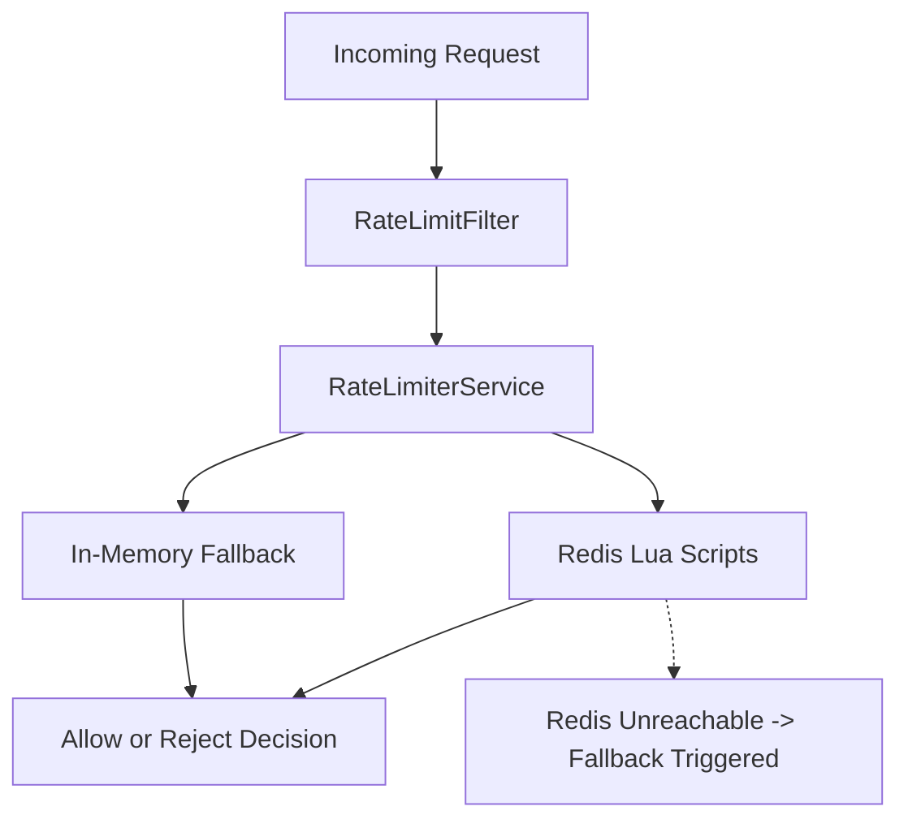

# Distributed Rate Limiter 🚀

A production-grade distributed rate limiting system built with **Java 17 and Spring Boot**.  
Implements multiple rate limiting algorithms backed by **Redis with atomic Lua scripts**, per-endpoint and per-tier configuration, automatic in-memory fallback, and full **Prometheus observability**.

---

## 📌 Table of Contents
- Architecture Overview  
- Algorithms Implemented  
- Features  
- Project Structure  
- Getting Started  
- API Reference  
- Configuration  
- Observability  
- Design Decisions  

---
## Architecture Overview


- Redis stores all distributed state  
- Lua scripts ensure atomic execution  
- Fallback ensures system availability if Redis is down  

---

## ⚙️ Algorithms Implemented

### 1. Token Bucket (Primary)
- Supports burst traffic
- Smooth rate enforcement
- Best for real-world APIs

### 2. Fixed Window Counter
- Simple and strict limiting
- Used for `/login` endpoint

### 3. Sliding Window Log
- Accurate rolling window
- Prevents edge-case burst issues
- Used for `/search`

### 4. Leaky Bucket
- Constant outflow rate
- Protects downstream services

---

## ✨ Features

- 4 rate limiting algorithms (Redis + Lua)
- Per-endpoint configuration
- User tiers: FREE / PRO / PREMIUM
- API key management system
- IP-based fallback limiting
- Automatic in-memory fallback if Redis is down
- Structured 429 responses
- Rate-limit headers in every response
- Prometheus metrics integration
- Spring Boot Actuator health checks
- No Lombok (pure Java)

---

## 📁 Project Structure
```
src/main/java/com/ratelimiter/

├── config/          # Redis, properties, filter configuration
├── controller/      # API + admin endpoints
├── filter/          # Rate limiting filter
├── model/           # Core models (tier, request, result)
├── service/
│   ├── algorithm/   # Rate limiting strategies
│   └── fallback/    # In-memory fallback logic
├── repository/      # API key storage layer
├── metrics/         # Prometheus metrics + health checks
├── exception/       # Global exception handling
└── RateLimiterApplication.java
```

---

## 🚀 Getting Started

### Prerequisites
- Java 17+
- Maven 3.8+
- Docker

---

### Start Redis
bash
docker run -d -p 6379:6379 --name redis redis:7-alpine

##Clone and Run
git clone https://github.com/your-username/distributed-rate-limiter
cd distributed-rate-limiter
mvn spring-boot:run

### Server runs at:
http://localhost:8080

### Test API
curl -H "X-API-Key: free-key-001" http://localhost:8080/api/search?q=java


### Trigger rate limit:

for i in {1..7}; do
  curl -s -o /dev/null -w "%{http_code}\n" \
  -X POST -H "X-API-Key: free-key-001" \
  -d '{"username":"test"}' \
  http://localhost:8080/api/login
done
## 🔑 API Keys

| Key              | Tier     | Limit        |
|------------------|----------|--------------|
| free-key-001     | FREE     | 10 req/min   |
| pro-key-001      | PRO      | 100 req/min  |
| premium-key-001  | PREMIUM  | 1000 req/min |

## 📡 API Reference

### Endpoints

| Endpoint       | Algorithm            | Limit        |
|----------------|----------------------|--------------|
| /api/login     | Fixed Window         | 5/min        |
| /api/search    | Sliding Window Log   | 500/min      |
| /api/payment   | Token Bucket         | 20/min       |
| /api/data      | Token Bucket         | Tier-based   |


#### Rate Limit Headers
```
X-RateLimit-Remaining: 47
X-RateLimit-Reset: 1714000860
X-RateLimit-Policy: TOKEN_BUCKET
```

#### 429 Response
```
{
  "status": 429,
  "error": "Too Many Requests",
  "message": "Rate limit exceeded",
  "retryAfter": 34,
  "algorithm": "TOKEN_BUCKET",
  "timestamp": "2025-01-15T10:30:00Z"
}
```

## ⚙️ Configuration
```
spring.data.redis.host=localhost
spring.data.redis.port=6379

rate.limiter.fallback.enabled=true

rate.limiter.tier.free.capacity=10
rate.limiter.tier.pro.capacity=100
rate.limiter.tier.premium.capacity=1000

rate.limiter.endpoint.login.limit=5
rate.limiter.endpoint.search.limit=500
```

## 📊 Observability
#### Health Check
```
curl http://localhost:8080/actuator/health
```
#### Prometheus Metrics
```
curl http://localhost:8080/actuator/prometheus
```
## 📊 Key Metrics

- Request allowed / denied counts  
- Fallback usage (in-memory activations)  
- Redis health status (UP/DOWN)  
- Per-tier request statistics (FREE / PRO / PREMIUM)


## 🧠 Design Decisions
#### Why Redis + Lua?
Ensures atomic operations and prevents race conditions in distributed environments.

#### Why Token Bucket?
Best balance between burst handling and long-term fairness.

#### Why fallback?
Ensures system availability even if Redis fails.

#### Why no Lombok?
Keeps codebase explicit, portable, and easy to debug.

## 📜 License
MIT


